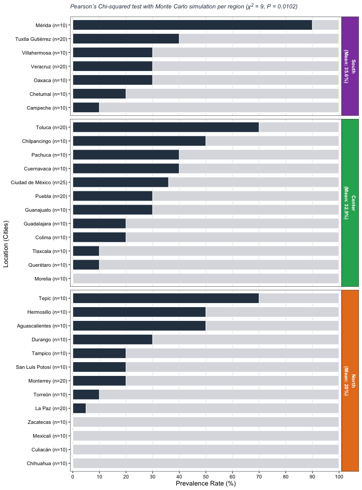
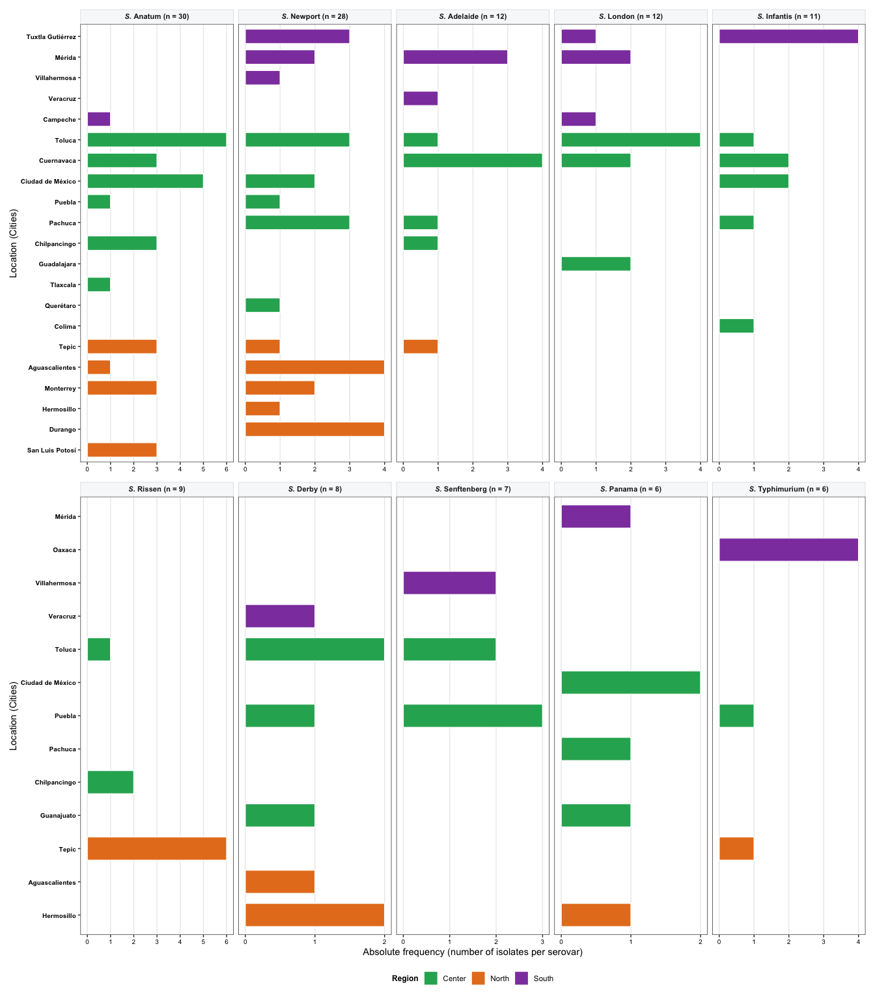
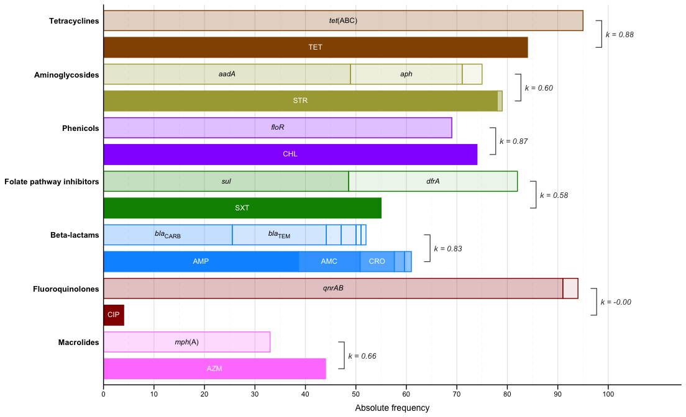

Prevalence and AMR analysis of *Salmonella* in ground beef - integrated
pipeline
================
Enrique J. Delgado Suárez
07 October, 2026

- [Project: Genomic epidemiology of *Salmonella* in Mexican retail
  ground
  beef](#project-genomic-epidemiology-of-salmonella-in-mexican-retail-ground-beef)
  - [I. Load required libraries](#i-load-required-libraries)
  - [II. Regional prevalence analysis (Fig. 1 and Table
    S2)](#ii-regional-prevalence-analysis-fig-1-and-table-s2)
  - [III. Serovar geographic distribution (Top 10 serovars, Fig.
    3)](#iii-serovar-geographic-distribution-top-10-serovars-fig-3)
  - [IV. Serovar diversity analysis and Hutcheson’s t-test (Table 2 and
    Table
    S3)](#iv-serovar-diversity-analysis-and-hutchesons-t-test-table-2-and-table-s3)
  - [V. Phenotypic–genotypic concordance and Cohen’s kappa analysis
    (Fig. 4 & Table
    S4)](#v-phenotypicgenotypic-concordance-and-cohens-kappa-analysis-fig-4--table-s4)
  - [VI. Univariate Firth’s risk factor screening at the population
    level (Table
    S5)](#vi-univariate-firths-risk-factor-screening-at-the-population-level-table-s5)
  - [VII. Multivariable Firth’s penalized logistic regression (only for
    AZM, Table
    S6)](#vii-multivariable-firths-penalized-logistic-regression-only-for-azm-table-s6)
  - [VIII. ER Cohort Serovar-Specific Univariable Firth Analysis (Table
    S7)](#viii-er-cohort-serovar-specific-univariable-firth-analysis-table-s7)
- [Supplementary Material](#supplementary-material)
  - [Supplementary Tables](#supplementary-tables)

------------------------------------------------------------------------

## Project: Genomic epidemiology of *Salmonella* in Mexican retail ground beef

------------------------------------------------------------------------

### I. Load required libraries

``` r
library(readxl)    # Reading Excel files
library(dplyr)     # Structured data manipulation and cleaning
library(tidyr)     # Data reshaping matrices
library(tidyverse) # Includes dplyr, tidyr, stringr, purrr, ggplot2
library(ggplot2)   # High-resolution graphics   
library(ggtext)    # Advanced text formatting in ggplot
library(patchwork) # Multi-panel figure composition
library(irr)       # Cohen's Kappa calculations
library(vegan)     # Serovar diversity analysis
library(logistf)   # Firth's penalized logistic regression
library(openxlsx)  # Write Excel files (.xlsx)
library(knitr)     # Producing Markdown tables
```

------------------------------------------------------------------------

### II. Regional prevalence analysis (Fig. 1 and Table S2)

``` r
# 1. Load and clean prevalence data
raw_data <- read_excel("Prevalence.xlsx", sheet = 1)

data_clean <- raw_data %>%
  rename(City_Label = 1) %>% 
  mutate(
    City_Label = stringr::str_trim(City_Label),
    Positive   = tidyr::replace_na(as.numeric(Positive), 0),
    Negative   = tidyr::replace_na(as.numeric(Negative), 0),
    Total      = Positive + Negative,
    Prevalence_Pct = ifelse(Total > 0, (Positive / Total) * 100, 0),
    City_Name  = stringr::str_remove(City_Label, " \\(n=\\d+\\)"),
    Region     = case_when(
      City_Name %in% c("Campeche", "Chetumal", "Chiapas", "Tuxtla Gutiérrez", "Mérida", "Oaxaca", "Veracruz", "Villahermosa") ~ "South",
      City_Name %in% c("Ciudad de México", "Cuernavaca", "Guadalajara", "Guanajuato", "Pachuca", "Puebla", "Querétaro", "Tlaxcala", "Toluca", "Morelia", "Xalapa", "Chilpancingo", "Colima") ~ "Center",
      City_Name %in% c("Aguascalientes", "San Luis Potosí", "Zacatecas", "Chihuahua", "Culiacán", "Durango", "Hermosillo", "La Paz", "Mexicali", "Monterrey", "Tampico", "Tepic", "Torreón", "Saltillo") ~ "North"
    )
  )

# 2. Build contingency table and execute global Chi-squared test with Monte Carlo
contingency_table <- data_clean %>%
  group_by(Region) %>%
  summarise(
    Positives = sum(Positive, na.rm = TRUE), 
    Negatives = sum(Negative, na.rm = TRUE), 
    .groups   = 'drop'
  )

matriz_stats <- as.matrix(contingency_table[, c("Positives", "Negatives")])
rownames(matriz_stats) <- contingency_table$Region

set.seed(123)
chi_test       <- chisq.test(matriz_stats)
chi_montecarlo <- chisq.test(matriz_stats, simulate.p.value = TRUE, B = 10000)

p_val_numeric_fixed <- chi_montecarlo$p.value
p_val_string <- if(p_val_numeric_fixed < 0.0001) "P < 0.0001" else paste0("P = ", sprintf("%.4f", p_val_numeric_fixed))

global_title_static <- paste0(
  "Pearson's Chi-squared test with Monte Carlo simulation per region (&chi;<sup>2</sup> = ",
  round(chi_test$statistic, 1), ", ", p_val_string, ")"
)

# 3. Calculate pairwise Wald odds ratios and p-values (reference: North region)
a  <- matriz_stats["North", "Positives"]; b  <- matriz_stats["North", "Negatives"]

# Center vs North
c1 <- matriz_stats["Center", "Positives"]; d1 <- matriz_stats["Center", "Negatives"]
or_center <- (c1 * b) / (a * d1)
se_center <- sqrt((1/c1) + (1/d1) + (1/a) + (1/b))
z_center  <- abs(log(or_center) / se_center)
p_center  <- 2 * (1 - pnorm(z_center))

# South vs North
c2 <- matriz_stats["South", "Positives"]; d2 <- matriz_stats["South", "Negatives"]
or_south  <- (c2 * b) / (a * d2)
se_south  <- sqrt((1/c2) + (1/d2) + (1/a) + (1/b))
z_south   <- abs(log(or_south) / se_south)
p_south   <- 2 * (1 - pnorm(z_south))

# Build Consolidated Supplementary Table S2 Data Frame
table_s2_regional_prevalence <- data.frame(
  Region              = c("North", "Center", "South"),
  `Positive Count`    = c(a, c1, c2),
  `Negative Count`    = c(b, d1, d2),
  `Total Isolates`    = c(a + b, c1 + d1, c2 + d2),
  `Prevalence (%)`    = round(c(a / (a + b), c1 / (c1 + d1), c2 / (c2 + d2)) * 100, 2),
  `Comparison Level`  = c("Baseline Reference", "Center vs. North", "South vs. North"),
  `Odds Ratio (OR)`   = c("1.00", sprintf("%.2f", or_center), sprintf("%.2f", or_south)),
  `95% CI`            = c("N/A", paste0("[", sprintf("%.2f", exp(log(or_center) - 1.96 * se_center)), ", ", sprintf("%.2f", exp(log(or_center) + 1.96 * se_center)), "]"),
                              paste0("[", sprintf("%.2f", exp(log(or_south) - 1.96 * se_south)), ", ", sprintf("%.2f", exp(log(or_south) + 1.96 * se_south)), "]")),
  `P-Value`           = c("N/A", ifelse(p_center < 0.0001, "< 0.0001", sprintf("%.4f", p_center)), ifelse(p_south < 0.0001, "< 0.0001", sprintf("%.4f", p_south))),
  stringsAsFactors    = FALSE,
  check.names         = FALSE
)

# Export Supplementary Table S2 to CSV
write_csv(table_s2_regional_prevalence, "Supplementary_Table_S2_Regional_Prevalence.csv")

# 4. Prepare data for plotting and build Figure 2
regional_stats <- data_clean %>%
  group_by(Region) %>%
  summarise(
    Reg_Positive = sum(Positive, na.rm = TRUE),
    Reg_Negative = sum(Negative, na.rm = TRUE),
    .groups      = 'drop'
  ) %>%
  mutate(
    Reg_Total    = Reg_Positive + Reg_Negative,
    Reg_Mean_Pct = (Reg_Positive / Reg_Total) * 100,
    Region_Label = paste0(Region, "\n(Mean: ", round(Reg_Mean_Pct, 1), "%)")
  )

data_final <- data_clean %>%
  mutate(
    Total = Positive + Negative,
    Prevalence_Pct = ifelse(Total > 0, (Positive / Total) * 100, 0)
  ) %>%
  inner_join(regional_stats, by = "Region")

city_ordered_levels <- data_final %>% 
  arrange(Prevalence_Pct, Reg_Total) %>% 
  pull(City_Label)

region_label_order <- regional_stats %>%
  mutate(Region = factor(Region, levels = c("South", "Center", "North"))) %>%
  arrange(Region) %>% 
  pull(Region_Label)

data_final <- data_final %>%
  mutate(
    City_Label   = factor(City_Label, levels = city_ordered_levels),
    Region_Label = factor(Region_Label, levels = region_label_order)
  )

prevalence_pct_plot <- ggplot(data_final, aes(y = City_Label)) +
  geom_col(aes(x = 100), fill = "#dcdde1", color = "white", width = 0.75) +
  geom_col(aes(x = Prevalence_Pct), fill = "#2c3e50", color = "white", width = 0.75) +
  facet_grid(Region_Label ~ ., scales = "free_y", space = "free_y") +
  scale_x_continuous(breaks = seq(0, 100, by = 10), labels = paste0(seq(0, 100, by = 10)), expand = c(0, 1)) +
  labs(title = global_title_static, x = "Prevalence Rate (%)", y = "Location (Cities)") +
  theme_bw(base_size = 11) +
  theme(
    plot.title   = ggtext::element_markdown(face = "italic", size = 10, color = "#2c3e50", margin = margin(b = 12)),
    strip.text.y = element_text(face = "bold", size = 8.5, angle = 270, lineheight = 1.2, color = "white"),
    panel.grid.minor   = element_blank(),
    panel.grid.major.y = element_blank(),
    axis.text.y  = element_text(size = 8.5, color = "black"),
    axis.text.x  = element_text(size = 8.5, color = "black")
  )

# Convert to Grob to apply custom panel colors
g <- ggplotGrob(prevalence_pct_plot)
strips <- which(grepl("strip-r", g$layout$name))
colors_panels <- c("#8e44ad", "#27ae60", "#e67e22")

for (i in seq_along(strips)) {
  g$grobs[[strips[i]]]$grobs[[1]]$children[[1]]$gp$fill <- colors_panels[i]
}

# 5. Render plot in Rmd and save high-resolution TIFF
grid::grid.newpage()
grid::grid.draw(g)
```



``` r
ggsave("figure_prevalence_300dpi.tiff", plot = g, device = "tiff", dpi = 300, width = 8.5, height = 11.5, units = "in", compression = "lzw")

# 6. Render clean Markdown table for Supplementary Table S2 in document
rownames(table_s2_regional_prevalence) <- NULL
knitr::kable(
  table_s2_regional_prevalence,
  caption = "Supplementary Table S2. Regional Salmonella Prevalence Counts, Chi-Squared Monte Carlo Test, and Pairwise Wald Odds Ratios (Baseline Reference: North)",
  align = c("l", "r", "r", "r", "r", "l", "r", "c", "c")
)
```

| Region | Positive Count | Negative Count | Total Isolates | Prevalence (%) | Comparison Level   | Odds Ratio (OR) |     95% CI     | P-Value |
|:-------|---------------:|---------------:|---------------:|---------------:|:-------------------|----------------:|:--------------:|:-------:|
| North  |             30 |            120 |            150 |          20.00 | Baseline Reference |            1.00 |      N/A       |   N/A   |
| Center |             51 |            104 |            155 |          32.90 | Center vs. North   |            1.96 | \[1.16, 3.31\] | 0.0114  |
| South  |             32 |             58 |             90 |          35.56 | South vs. North    |            2.21 | \[1.23, 3.98\] | 0.0084  |

Supplementary Table S2. Regional Salmonella Prevalence Counts,
Chi-Squared Monte Carlo Test, and Pairwise Wald Odds Ratios (Baseline
Reference: North)

------------------------------------------------------------------------

### III. Serovar geographic distribution (Top 10 serovars, Fig. 3)

``` r
# 1. LOAD, CLEAN AND FILTER "OTHERS"
data_vertical_saved <- read_excel("Serovars_adjusted.xlsx", sheet = 1)

data_regional <- data_vertical_saved %>%
  filter(Serovar != "Others") %>% # Filter out "Others" before calculating frequencies
  mutate(
    City_Name = stringr::str_trim(stringr::str_remove(City, " \\(n=\\d+\\)")),
    Region = case_when(
      City_Name %in% c("Campeche", "Chetumal", "Chiapas", "Tuxtla Gutiérrez", "Mérida", "Oaxaca", "Veracruz", "Villahermosa") ~ "South",
      City_Name %in% c("Ciudad de México", "Cuernavaca", "Guadalajara", "Guanajuato", "Pachuca", "Puebla", "Querétaro", "Tlaxcala", "Toluca", "Morelia", "Xalapa", "Chilpancingo", "Colima") ~ "Center",
      City_Name %in% c("Aguascalientes", "San Luis Potosí", "Zacatecas", "Chihuahua", "Culiacán", "Durango", "Hermosillo", "La Paz", "Mexicali", "Monterrey", "Tampico", "Tepic", "Torreón", "Saltillo") ~ "North"
    )
  )

# Calculate totals per city to establish inner-region cascade
city_totals <- data_regional %>%
  group_by(City, Region) %>%
  summarise(Total_City = sum(Frequency), .groups = 'drop')

# Reverse hierarchical order for correct Y-axis visualization
city_order <- city_totals %>%
  mutate(Region = factor(Region, levels = c("North", "Center", "South"))) %>%
  arrange(Region, Total_City) %>%
  pull(City)

# Filter zeroes for plotting
data_plot <- data_regional %>%
  filter(Frequency > 0)

# Calculate explicit hierarchical order for the TRUE TOP 10 Serovars
serovar_totals <- data_plot %>%
  group_by(Serovar) %>%
  summarise(Total = sum(Frequency), .groups = 'drop') %>%
  arrange(desc(Total)) %>%
  slice_head(n = 10) # Extract strictly top 10 abundant serovars

serovar_order <- serovar_totals %>% pull(Serovar)

# Filter dataset to match only the Top 10 specific serovars
data_plot <- data_plot %>%
  filter(Serovar %in% serovar_order) %>%
  left_join(serovar_totals, by = "Serovar") %>%
  mutate(
    Serovar = factor(Serovar, levels = serovar_order),
    Serovar_Label = paste0("*S.* ", Serovar, " (n = ", Total, ")"),
    Serovar_Label = factor(Serovar_Label, levels = unique(paste0("*S.* ", serovar_order, " (n = ", serovar_totals$Total, ")"))),
    City = factor(City, levels = city_order)
  )

# Institutional palette for regional display
regional_palette <- c("South" = "#8e44ad", "Center" = "#27ae60", "North" = "#e67e22")

# STEP 2: SPLIT DATA INTO TWO SUBSETS (5 SEROVARS EACH)
top_10_labels <- levels(data_plot$Serovar_Label)[1:10]
labels_panel_1 <- top_10_labels[1:5]
labels_panel_2 <- top_10_labels[6:10]

data_panel_1 <- data_plot %>% filter(Serovar_Label %in% labels_panel_1)
data_panel_2 <- data_plot %>% filter(Serovar_Label %in% labels_panel_2)

# STEP 3: FUNCTION TO BUILD GRAPHICS WITH UNIFIED CRITERIA
build_serovar_plot <- function(dataset, is_bottom_panel = FALSE) {
  p <- ggplot(dataset, aes(x = Frequency, y = City, fill = Region)) +
    geom_col(color = "white", width = 0.7) +
    facet_wrap(~ Serovar_Label, ncol = 5, scales = "free_x") +
    scale_x_continuous(breaks = function(x) seq(0, ceiling(max(x)), by = 1)) +
    scale_fill_manual(values = regional_palette, name = "Region") +
    theme_bw(base_size = 11) +
    theme(
      strip.text = ggtext::element_markdown(face = "bold", size = 8.5),
      strip.background = element_rect(fill = "#f8f9fa", color = "#dcdde1"),
      panel.grid.minor = element_blank(),
      panel.grid.major.y = element_blank(),
      axis.text.y = element_text(size = 7.5, face = "bold", color = "black"),
      axis.text.x = element_text(size = 7.5, color = "black"),
      legend.position = "bottom",
      legend.title = element_text(face = "bold", size = 9)
    )
  
  if (is_bottom_panel) {
    p <- p + labs(x = "Absolute frequency (number of isolates per serovar)", y = "Location (Cities)")
  } else {
    p <- p + labs(x = NULL, y = "Location (Cities)")
  }
  return(p)
}

plot_panel_1 <- build_serovar_plot(data_panel_1, is_bottom_panel = FALSE)
plot_panel_2 <- build_serovar_plot(data_panel_2, is_bottom_panel = TRUE)

# STEP 4: COMBINE PANELS AND LEGENDS WITH PATCHWORK
unified_figure <- plot_panel_1 / plot_panel_2
unified_figure <- unified_figure + plot_layout(guides = "collect") & theme(legend.position = "bottom")

# STEP 5: EXPORT THE SINGLE DEFINITIVE TIFF AT 300 DPI
ggsave("figure_serovars_top10_unified_300dpi.tiff",
       plot = unified_figure,
       device = "tiff", dpi = 300, width = 14, height = 16, units = "in", compression = "lzw")

cat("\n[SUCCESS] Top 10 Serovars Figure exported successfully!\n")
```

    ## 
    ## [SUCCESS] Top 10 Serovars Figure exported successfully!

``` r
# 6. Render ONLY the single combined figure
print(unified_figure)
```



------------------------------------------------------------------------

### IV. Serovar diversity analysis and Hutcheson’s t-test (Table 2 and Table S3)

``` r
# 1. Load adjusted serovar dataset
data_vertical_saved <- read_excel("Serovars_adjusted.xlsx", sheet = 1)

data_base_cities <- data_vertical_saved %>%
  mutate(
    City_Name = stringr::str_trim(stringr::str_remove(City, " \\(n=\\d+\\)")),
    Region    = case_when(
      City_Name %in% c("Campeche", "Chetumal", "Chiapas", "Tuxtla Gutiérrez", "Mérida", "Oaxaca", "Veracruz", "Villahermosa") ~ "South",
      City_Name %in% c("Ciudad de México", "Cuernavaca", "Guadalajara", "Guanajuato", "Pachuca", "Puebla", "Querétaro", "Tlaxcala", "Toluca", "Morelia", "Xalapa", "Chilpancingo", "Colima") ~ "Center",
      City_Name %in% c("Aguascalientes", "San Luis Potosí", "Zacatecas", "Chihuahua", "Culiacán", "Durango", "Hermosillo", "La Paz", "Mexicali", "Monterrey", "Tampico", "Tepic", "Torreón", "Saltillo") ~ "North"
    )
  )

# PART A: SUPPLEMENTARY TABLE S3 - DIVERSITY BY INDIVIDUAL CITY
data_city_wide <- data_base_cities %>%
  group_by(Region, City, Serovar) %>%
  summarise(Frequency = sum(Frequency), .groups = 'drop') %>%
  pivot_wider(names_from = Serovar, values_from = Frequency, values_fill = 0)

matrix_city <- as.matrix(data_city_wide[, -c(1, 2)])
rownames(matrix_city) <- data_city_wide$City

richness_city <- vegan::specnumber(matrix_city)
shannon_city  <- vegan::diversity(matrix_city, index = "shannon")
pielou_city   <- ifelse(richness_city > 1, shannon_city / log(richness_city), 1.000)

table_s3_city_diversity <- data.frame(
  Region                  = data_city_wide$Region,
  `Location (City)`       = data_city_wide$City,
  `Total Isolates (N)`    = rowSums(matrix_city),
  `Serovar Richness (S)`  = richness_city,
  `Shannon Index (H')`    = round(shannon_city, 3),
  `Pielou's Evenness (J')` = round(pielou_city, 3),
  check.names             = FALSE
) %>%
  arrange(factor(Region, levels = c("North", "Center", "South")), desc(`Total Isolates (N)`))

write_csv(table_s3_city_diversity, "Supplementary_Table_S3_City_Diversity.csv")

# PART B: INTEGRATED TABLE 2 - REGIONAL DIVERSITY & HUTCHESON'S T-TEST
data_regional <- data_base_cities %>%
  group_by(Region, Serovar) %>%
  summarise(Frequency = sum(Frequency), .groups = 'drop') %>%
  pivot_wider(names_from = Serovar, values_from = Frequency, values_fill = 0)

matrix_regional <- as.matrix(data_regional[, -1])
rownames(matrix_regional) <- data_regional$Region

n_north  <- sum(matrix_regional["North", ])
n_center <- sum(matrix_regional["Center", ])
n_south  <- sum(matrix_regional["South", ])

s_north  <- vegan::specnumber(matrix_regional["North", , drop = FALSE])
s_center <- vegan::specnumber(matrix_regional["Center", , drop = FALSE])
s_south  <- vegan::specnumber(matrix_regional["South", , drop = FALSE])

h_north  <- vegan::diversity(matrix_regional["North", , drop = FALSE], index = "shannon")
h_center <- vegan::diversity(matrix_regional["Center", , drop = FALSE], index = "shannon")
h_south  <- vegan::diversity(matrix_regional["South", , drop = FALSE], index = "shannon")

calc_hutcheson <- function(v1, v2) {
  v1 <- v1[v1 > 0]; v2 <- v2[v2 > 0]
  N1 <- sum(v1); N2 <- sum(v2)
  p1 <- v1 / N1; p2 <- v2 / N2
  
  H1 <- -sum(p1 * log(p1))
  H2 <- -sum(p2 * log(p2))
  
  var1 <- (sum(p1 * (log(p1))^2) - H1^2) / N1 + (length(v1) - 1) / (2 * N1^2)
  var2 <- (sum(p2 * (log(p2))^2) - H2^2) / N2 + (length(v2) - 1) / (2 * N2^2)
  
  t_stat <- (H1 - H2) / sqrt(var1 + var2)
  df     <- ((var1 + var2)^2) / ((var1^2 / N1) + (var2^2 / N2))
  p_val  <- 2 * pt(-abs(t_stat), df)
  
  list(
    t_stat = sprintf("%.2f", t_stat),
    df     = sprintf("%.1f", df),
    p_val  = ifelse(p_val < 0.0001, "< 0.0001", sprintf("%.4f", p_val))
  )
}

v_north  <- as.numeric(data_regional[data_regional$Region == "North", -1])
v_center <- as.numeric(data_regional[data_regional$Region == "Center", -1])
v_south  <- as.numeric(data_regional[data_regional$Region == "South", -1])

h_nc <- calc_hutcheson(v_north, v_center)
h_ns <- calc_hutcheson(v_north, v_south) 
h_sc <- calc_hutcheson(v_south, v_center)

table_2_integrated <- data.frame(
  `Geographical regions` = c("n", "Serovar richness (S)", "Shannon index (H')", "Pairwise comparisons", "Hutcheson's t", "Degrees of freedom", "P-value"),
  `North`  = c(as.character(n_north), as.character(s_north), sprintf("%.2f", h_north), "North vs Center", h_nc$t_stat, h_nc$df, h_nc$p_val),
  `Center` = c(as.character(n_center), as.character(s_center), sprintf("%.2f", h_center), "North vs South", h_ns$t_stat, h_ns$df, h_ns$p_val),
  `South`  = c(as.character(n_south), as.character(s_south), sprintf("%.2f", h_south), "South vs Center", h_sc$t_stat, h_sc$df, h_sc$p_val),
  check.names = FALSE,
  stringsAsFactors = FALSE
)

write_csv(table_2_integrated, "Table_2_Integrated_Regional_Diversity.csv")

rownames(table_s3_city_diversity) <- NULL
rownames(table_2_integrated)      <- NULL

knitr::kable(
  table_s3_city_diversity,
  caption = "Supplementary Table S3. *Salmonella* Serovar Diversity Estimates and Shannon-Wiener Index (*H'*) Across Individual Sampling Cities",
  align = c("l", "l", "r", "r", "r", "r")
)
```

| Region | Location (City)  | Total Isolates (N) | Serovar Richness (S) | Shannon Index (H’) | Pielou’s Evenness (J’) |
|:-------|:-----------------|-------------------:|---------------------:|-------------------:|-----------------------:|
| North  | Tepic            |                 12 |                    5 |              1.314 |                  0.817 |
| North  | Aguascalientes   |                  9 |                    4 |              1.215 |                  0.876 |
| North  | Hermosillo       |                  7 |                    4 |              1.277 |                  0.921 |
| North  | Durango          |                  6 |                    2 |              0.637 |                  0.918 |
| North  | Monterrey        |                  6 |                    3 |              1.011 |                  0.921 |
| North  | San Luis Potosí  |                  4 |                    2 |              0.562 |                  0.811 |
| North  | Tampico          |                  2 |                    1 |              0.000 |                  1.000 |
| North  | La Paz           |                  1 |                    1 |              0.000 |                  1.000 |
| North  | Torreón          |                  1 |                    1 |              0.000 |                  1.000 |
| Center | Toluca           |                 27 |                    9 |              1.963 |                  0.893 |
| Center | Ciudad de México |                 12 |                    5 |              1.468 |                  0.912 |
| Center | Cuernavaca       |                 11 |                    4 |              1.342 |                  0.968 |
| Center | Puebla           |                 10 |                    6 |              1.643 |                  0.917 |
| Center | Pachuca          |                  8 |                    5 |              1.494 |                  0.928 |
| Center | Chilpancingo     |                  6 |                    3 |              1.011 |                  0.921 |
| Center | Guanajuato       |                  4 |                    3 |              1.040 |                  0.946 |
| Center | Guadalajara      |                  3 |                    2 |              0.637 |                  0.918 |
| Center | Colima           |                  2 |                    2 |              0.693 |                  1.000 |
| Center | Querétaro        |                  1 |                    1 |              0.000 |                  1.000 |
| Center | Tlaxcala         |                  1 |                    1 |              0.000 |                  1.000 |
| South  | Mérida           |                 17 |                    5 |              1.313 |                  0.816 |
| South  | Tuxtla Gutiérrez |                 11 |                    4 |              1.295 |                  0.934 |
| South  | Veracruz         |                  7 |                    3 |              0.796 |                  0.725 |
| South  | Campeche         |                  6 |                    3 |              0.868 |                  0.790 |
| South  | Oaxaca           |                  4 |                    1 |              0.000 |                  1.000 |
| South  | Chetumal         |                  3 |                    1 |              0.000 |                  1.000 |
| South  | Villahermosa     |                  3 |                    2 |              0.637 |                  0.918 |

Supplementary Table S3. *Salmonella* Serovar Diversity Estimates and
Shannon-Wiener Index (*H’*) Across Individual Sampling Cities

``` r
knitr::kable(
  table_2_integrated,
  caption = "Table 2. Regional Diversity Metrics and Pairwise Hutcheson's *t*-Test Comparisons of Shannon Diversity Indices Across Geographical Regions",
  align = c("l", "c", "c", "c")
)
```

| Geographical regions |      North      |     Center     |      South      |
|:---------------------|:---------------:|:--------------:|:---------------:|
| n                    |       48        |       85       |       51        |
| Serovar richness (S) |        8        |       11       |       10        |
| Shannon index (H’)   |      1.71       |      2.17      |      1.76       |
| Pairwise comparisons | North vs Center | North vs South | South vs Center |
| Hutcheson’s t        |      -3.54      |     -0.30      |      -2.43      |
| Degrees of freedom   |      91.9       |      91.2      |      75.7       |
| P-value              |     0.0006      |     0.7635     |     0.0176      |

Table 2. Regional Diversity Metrics and Pairwise Hutcheson’s *t*-Test
Comparisons of Shannon Diversity Indices Across Geographical Regions

------------------------------------------------------------------------

### V. Phenotypic–genotypic concordance and Cohen’s kappa analysis (Fig. 4 & Table S4)

``` r
# 1. Load data & clean numeric values
df_matrix <- read_excel("Results_matrixb.xlsx") %>%
  mutate(across(everything(), ~ suppressWarnings(as.numeric(.))))

tet_geno_cols <- colnames(df_matrix)[str_detect(colnames(df_matrix), "(?i)tet")]
mph_geno_cols <- colnames(df_matrix)[str_detect(colnames(df_matrix), "(?i)mph")]

groups_def <- list(
  "Beta-lactams"              = list(pheno = c("AMP", "AMC", "CRO", "FEP", "MEM"), geno = c("blaCARB", "blaPSE", "blaTEM", "blaCTXM", "blaSHV", "blaCMY")),
  "Aminoglycosides"           = list(pheno = c("STR", "AMK"), geno = c("aac", "aadA", "aph")),
  "Fluoroquinolones"          = list(pheno = c("CIP"), geno = c("qnrAB", "oqxAB")),
  "Tetracyclines"             = list(pheno = c("TET"), geno = tet_geno_cols),
  "Phenicols"                 = list(pheno = c("CHL"), geno = c("floR")),
  "Folate pathway inhibitors" = list(pheno = c("SXT"), geno = c("sul", "dfrA")),
  "Macrolides"                = list(pheno = c("AZM"), geno = mph_geno_cols)
)

class_summary <- map_dfr(names(groups_def), function(grp) {
  p_cols <- intersect(groups_def[[grp]]$pheno, colnames(df_matrix))
  g_cols <- intersect(groups_def[[grp]]$geno, colnames(df_matrix))
  
  pheno_pos <- if_else(rowSums(df_matrix[, p_cols, drop = FALSE], na.rm = TRUE) > 0, 1, 0)
  geno_pos  <- if_else(rowSums(df_matrix[, g_cols, drop = FALSE], na.rm = TRUE) > 0, 1, 0)
  
  k_val <- if(length(unique(pheno_pos)) == 1 && length(unique(geno_pos)) == 1) {
    "1.00"
  } else {
    sprintf("%.2f", kappa2(data.frame(pheno_pos, geno_pos))$value)
  }
  
  tibble(Gene_Group = grp, Pheno_Count = sum(pheno_pos), Geno_Count = sum(geno_pos), Kappa = k_val)
})

class_colors <- c(
  "Aminoglycosides"           = "#A9A742",
  "Beta-lactams"              = "#0096FF",
  "Phenicols"                 = "#9437FF",
  "Folate pathway inhibitors" = "#008F00",
  "Fluoroquinolones"          = "#941100",
  "Tetracyclines"             = "#945200",
  "Macrolides"                = "#FF85FF"
)

df_pheno_raw <- df_matrix %>%
  pivot_longer(cols = everything(), names_to = "Feature", values_to = "Value") %>%
  filter(Feature %in% c("AMP", "AMC", "CRO", "FEP", "MEM", "STR", "AMK", "CIP", "TET", "CHL", "SXT", "AZM")) %>%
  group_by(Feature) %>%
  summarise(Raw_Pheno_Count = sum(Value, na.rm = TRUE), .groups = "drop") %>%
  filter(Raw_Pheno_Count > 0) %>%
  mutate(
    Gene_Group = case_when(
      Feature %in% c("STR", "AMK") ~ "Aminoglycosides",
      Feature %in% c("AMP", "AMC", "CRO", "FEP", "MEM") ~ "Beta-lactams",
      Feature == "SXT" ~ "Folate pathway inhibitors",
      Feature == "CIP" ~ "Fluoroquinolones",
      Feature == "TET" ~ "Tetracyclines",
      Feature == "CHL" ~ "Phenicols",
      Feature == "AZM" ~ "Macrolides"
    )
  )

df_pheno_plot <- df_pheno_raw %>%
  left_join(class_summary %>% select(Gene_Group, Pheno_Count), by = "Gene_Group") %>%
  group_by(Gene_Group) %>%
  mutate(
    Prevalence = (Raw_Pheno_Count / sum(Raw_Pheno_Count)) * Pheno_Count,
    Rank_Group = dense_rank(Raw_Pheno_Count),
    Alpha_Val  = case_when(max(Rank_Group) == 1 ~ 1.0, TRUE ~ 0.45 + (Rank_Group - 1) / (max(Rank_Group) - 1) * 0.55),
    DataType = "Phenotype",
    Fill_Color = alpha(class_colors[Gene_Group], Alpha_Val),
    Border_Color = class_colors[Gene_Group],
    Text_Color = "white",
    Label_Formatted = Feature,
    Label_Inside = if_else(Raw_Pheno_Count >= 6 | Feature %in% c("CIP", "TET"), Label_Formatted, ""),
    Text_Size = 3.1
  ) %>% ungroup()

df_geno_raw <- df_matrix %>%
  pivot_longer(cols = everything(), names_to = "Feature", values_to = "Value") %>%
  filter(!Feature %in% c("AMP", "AMC", "CRO", "FEP", "MEM", "STR", "AMK", "CIP", "TET", "CHL", "SXT", "AZM")) %>%
  group_by(Feature) %>%
  summarise(Raw_Gene_Count = sum(Value, na.rm = TRUE), .groups = "drop") %>%
  filter(Raw_Gene_Count > 0) %>%
  mutate(
    Gene_Group = case_when(
      Feature %in% c("sul", "dfrA") ~ "Folate pathway inhibitors",
      Feature %in% c("aac", "aadA", "aph") ~ "Aminoglycosides",
      Feature %in% c("qnrAB", "oqxAB") ~ "Fluoroquinolones",
      str_detect(Feature, "(?i)tet") ~ "Tetracyclines",
      Feature == "floR" ~ "Phenicols",
      str_detect(Feature, "^bla") ~ "Beta-lactams",
      str_detect(Feature, "(?i)mph") ~ "Macrolides",
      TRUE ~ "Others"
    )
  ) %>% filter(Gene_Group != "Others")

df_geno_plot <- df_geno_raw %>%
  left_join(class_summary %>% select(Gene_Group, Geno_Count), by = "Gene_Group") %>%
  group_by(Gene_Group) %>%
  mutate(
    Prevalence = (Raw_Gene_Count / sum(Raw_Gene_Count)) * Geno_Count,
    Rank_Group = dense_rank(Raw_Gene_Count),
    Alpha_Val  = case_when(max(Rank_Group) == 1 ~ 1.0, TRUE ~ 0.35 + (Rank_Group - 1) / (max(Rank_Group) - 1) * 0.65),
    DataType = "Genotype",
    Fill_Color = alpha(class_colors[Gene_Group], Alpha_Val * 0.25),
    Border_Color = class_colors[Gene_Group],
    Text_Color = "black",
    Label_Formatted = case_when(
      str_detect(Feature, "^bla") ~ str_replace(Feature, "^bla(.*)$", "<i>bla</i><sub>\\1</sub>"),
      str_detect(Feature, "(?i)tet") ~ "<i>tet</i>(ABC)",
      str_detect(Feature, "(?i)mph") ~ "<i>mph</i>(A)",
      TRUE ~ paste0("<i>", Feature, "</i>")
    ),
    Label_Inside = if_else(Raw_Gene_Count >= 6 | str_detect(Feature, "(?i)tet"), Label_Formatted, "")
  ) %>% ungroup()

df_combined <- bind_rows(df_pheno_plot, df_geno_plot)
group_order <- class_summary %>% arrange(Geno_Count + Pheno_Count) %>% pull(Gene_Group)
pair_levels <- unlist(lapply(group_order, function(grp) { c(paste0("Phenotype.", grp), paste0("Genotype.", grp)) }))

df_combined <- df_combined %>%
  mutate(
    Gene_Group = factor(Gene_Group, levels = group_order),
    DataType   = factor(DataType, levels = c("Phenotype", "Genotype")),
    Y_Discrete = factor(paste0(DataType, ".", Gene_Group), levels = pair_levels)
  )

bracket_positions <- df_combined %>%
  group_by(Gene_Group) %>%
  summarise(
    Max_X = max(sum(Prevalence[DataType == "Phenotype"]), sum(Prevalence[DataType == "Genotype"])),
    Y_Geno_Idx = match(paste0("Genotype.", first(Gene_Group)), pair_levels),
    Y_Pheno_Idx = match(paste0("Phenotype.", first(Gene_Group)), pair_levels),
    Y_Center_Idx = (Y_Geno_Idx + Y_Pheno_Idx) / 2,
    .groups = "drop"
  ) %>%
  left_join(class_summary %>% select(Gene_Group, Kappa), by = "Gene_Group") %>%
  mutate(
    Bracket_X = Max_X + 2.5,
    Text_X    = Bracket_X + 2.0
  )

bracket_paths <- bracket_positions %>%
  select(Gene_Group, Bracket_X, Y_Geno_Idx, Y_Pheno_Idx) %>%
  pmap_dfr(function(Gene_Group, Bracket_X, Y_Geno_Idx, Y_Pheno_Idx) {
    tibble(
      Gene_Group = Gene_Group,
      x = c(Bracket_X, Bracket_X + 1.2, Bracket_X + 1.2, Bracket_X),
      y = c(Y_Geno_Idx, Y_Geno_Idx, Y_Pheno_Idx, Y_Pheno_Idx)
    )
  })

max_x_axis <- max(bracket_positions$Text_X) + 15

p_concordance <- ggplot(df_combined, aes(x = Prevalence, y = Y_Discrete, fill = Fill_Color, color = Border_Color, group = reorder(Label_Formatted, Prevalence))) +
  geom_bar(stat = "identity", position = "stack", width = 0.75, linewidth = 0.5) +
  geom_richtext(aes(label = Label_Inside, color = Text_Color), position = position_stack(vjust = 0.5), size = 3.1, fill = NA, label.color = NA) +
  geom_path(data = bracket_paths, aes(x = x, y = y, group = Gene_Group), inherit.aes = FALSE, color = "grey30", linewidth = 0.45) +
  geom_text(data = bracket_positions, aes(x = Text_X, y = Y_Center_Idx, label = paste0("k = ", Kappa)), inherit.aes = FALSE, hjust = 0, size = 3.3, fontface = "italic", color = "grey20") +
  scale_fill_identity() +
  scale_color_identity() +
  scale_y_discrete(labels = function(x) if_else(str_detect(x, "^Genotype\\."), gsub("^Genotype\\.", "", x), "")) +
  scale_x_continuous(breaks = seq(0, 100, by = 10), minor_breaks = seq(0, 100, by = 5), limits = c(0, max_x_axis), expand = c(0, 0)) +
  labs(x = "Absolute frequency", y = NULL) +
  theme_classic() +
  theme(
    axis.text.x = element_text(color = "black", size = 8.5),
    axis.text.y = element_text(color = "black", size = 9.5, face = "bold"),
    axis.title.x = element_text(face = "plain", size = 10.5, margin = margin(t = 8)),
    legend.position = "none",
    axis.ticks.y = element_blank(),
    axis.ticks.x = element_line(color = "black", linewidth = 0.5),
    axis.ticks.length.x = unit(0.2, "cm"),
    panel.grid.major.x = element_line(color = "grey90", linewidth = 0.4),
    panel.grid.minor.x = element_line(color = "grey95", linewidth = 0.2, linetype = "dashed")
  )

print(p_concordance)
```



``` r
ggsave("figure_concordance_300dpi.svg", plot = p_concordance, device = "svg", width = 11.5, height = 7, dpi = 300)
ggsave("figure_concordance_300dpi.tiff", plot = p_concordance, device = "tiff", width = 11.5, height = 7, dpi = 300, compression = "lzw")

# Function for Full Supplementary Table S4 (Clean text formatting)
get_full_kappa_with_ase <- function(df, pheno_cols, geno_cols, class_name) {
  p_cols <- intersect(pheno_cols, colnames(df))
  g_cols <- intersect(geno_cols, colnames(df))
  
  if (length(p_cols) == 1 && length(g_cols) == 1) {
    p_vec <- df[[p_cols]]
    g_vec <- df[[g_cols]]
  } else {
    p_vec <- if_else(rowSums(df[, p_cols, drop = FALSE], na.rm = TRUE) > 0, 1, 0)
    g_vec <- if_else(rowSums(df[, g_cols, drop = FALSE], na.rm = TRUE) > 0, 1, 0)
  }
  
  res <- kappa2(data.frame(p_vec, g_vec))
  kappa_val <- res$value
  ase_val <- if (!is.null(res$statistic) && !is.na(res$statistic) && res$statistic != 0) { abs(kappa_val / res$statistic) } else { 0.000 }
  
  ci_lower <- max(-1.0, kappa_val - (1.96 * ase_val))
  ci_upper <- min(1.0, kappa_val + (1.96 * ase_val))
  
  tibble(
    `Antibiotic Class / Category` = class_name,
    `Phenotypic Positives (N)`   = sum(p_vec, na.rm = TRUE),
    `Genotypic Positives (N)`    = sum(g_vec, na.rm = TRUE),
    `Cohen's Kappa (k)`          = sprintf("%.2f", kappa_val),
    `ASE`                        = sprintf("%.3f", ase_val),
    `95% CI`                     = paste0("[", sprintf("%.2f", ci_lower), ", ", sprintf("%.2f", ci_upper), "]"),
    `Z-statistic`                = sprintf("%.2f", res$statistic),
    `P-Value`                    = if_else(res$p.value < 0.0001, "< 0.0001", sprintf("%.4f", res$p.value))
  )
}

table_s4_kappa_concordance <- bind_rows(
  get_full_kappa_with_ase(df_matrix, c("AMP", "AMC", "CRO", "FEP", "MEM"), c("blaCARB", "blaPSE", "blaTEM", "blaCTXM", "blaSHV", "blaCMY"), "Beta-lactams"),
  get_full_kappa_with_ase(df_matrix, c("STR", "AMK"), c("aac", "aadA", "aph"), "Aminoglycosides"),
  get_full_kappa_with_ase(df_matrix, "CIP", c("qnrAB", "oqxAB"), "Fluoroquinolones"),
  get_full_kappa_with_ase(df_matrix, "TET", tet_geno_cols, "Tetracyclines"),
  get_full_kappa_with_ase(df_matrix, "CHL", "floR", "Phenicols"),
  get_full_kappa_with_ase(df_matrix, "SXT", c("sul", "dfrA"), "Folate pathway inhibitors"),
  get_full_kappa_with_ase(df_matrix, "AZM", mph_geno_cols, "Macrolides"),
  get_full_kappa_with_ase(df_matrix, "MDRp", "MDRg", "Multidrug Resistance (MDR)")
)

write_csv(table_s4_kappa_concordance, "Supplementary_Table_S4_Kappa_Concordance.csv")

rownames(table_s4_kappa_concordance) <- NULL
knitr::kable(
  table_s4_kappa_concordance,
  caption = "Supplementary Table S4. Phenotypic-Genotypic Concordance Analysis & Cohen's Kappa Estimates Across Antibiotic Classes and Multidrug Resistance (MDR)",
  align = c("l", "r", "r", "r", "r", "c", "r", "c")
)
```

| Antibiotic Class / Category | Phenotypic Positives (N) | Genotypic Positives (N) | Cohen’s Kappa (k) |   ASE |     95% CI      | Z-statistic |  P-Value  |
|:----------------------------|-------------------------:|------------------------:|------------------:|------:|:---------------:|------------:|:---------:|
| Beta-lactams                |                       61 |                      52 |              0.83 | 0.073 | \[0.69, 0.98\]  |       11.39 | \< 0.0001 |
| Aminoglycosides             |                       79 |                      75 |              0.60 | 0.074 | \[0.45, 0.74\]  |        8.12 | \< 0.0001 |
| Fluoroquinolones            |                        4 |                      94 |             -0.00 | 0.021 | \[-0.04, 0.04\] |       -0.04 |  0.9649   |
| Tetracyclines               |                       84 |                      95 |              0.88 | 0.073 | \[0.74, 1.00\]  |       12.03 | \< 0.0001 |
| Phenicols                   |                       74 |                      69 |              0.87 | 0.074 | \[0.73, 1.00\]  |       11.88 | \< 0.0001 |
| Folate pathway inhibitors   |                       55 |                      82 |              0.58 | 0.070 | \[0.44, 0.72\]  |        8.26 | \< 0.0001 |
| Macrolides                  |                       44 |                      33 |              0.66 | 0.073 | \[0.51, 0.80\]  |        9.06 | \< 0.0001 |
| Multidrug Resistance (MDR)  |                       78 |                      81 |              0.81 | 0.074 | \[0.67, 0.96\]  |       11.02 | \< 0.0001 |

Supplementary Table S4. Phenotypic-Genotypic Concordance Analysis &
Cohen’s Kappa Estimates Across Antibiotic Classes and Multidrug
Resistance (MDR)

------------------------------------------------------------------------

### VI. Univariate Firth’s risk factor screening at the population level (Table S5)

``` r
# 1. Load dataset and clean core variables (Serovar, Region, Outlet Type, MDR)
raw_er_data <- read_excel("Results_matrix.xlsx", sheet = 1)
data_er <- raw_er_data

if ("Serotipo" %in% colnames(data_er)) {
  data_er <- data_er %>% mutate(Serovar = stringr::str_trim(Serotipo))
} else if ("Serovar" %in% colnames(data_er)) {
  data_er <- data_er %>% mutate(Serovar = stringr::str_trim(Serovar))
}

er_serovars_list <- c("Anatum", "1,4,[5],12:i:-", "Agona", "Derby", "Give", 
                      "Infantis", "London", "Montevideo", "Muenchen", "Muenster", 
                      "Newport", "Senftenberg", "Typhimurium")

data_er <- data_er %>%
  mutate(
    Serovar_Group = ifelse(Serovar %in% er_serovars_list, "ER", "Others"),
    Serovar_Group = factor(Serovar_Group, levels = c("Others", "ER"))
  )

if ("Region" %in% colnames(data_er)) {
  data_er <- data_er %>% mutate(Region = factor(Region))
  if ("North" %in% levels(data_er$Region)) {
    data_er$Region <- relevel(data_er$Region, ref = "North")
  }
}

if ("Outlet_type" %in% colnames(data_er)) {
  data_er <- data_er %>% mutate(Outlet_type = factor(Outlet_type))
} else if ("Outlet_Type" %in% colnames(data_er)) {
  data_er <- data_er %>% mutate(Outlet_type = factor(Outlet_Type))
}

if ("Supermarket" %in% levels(data_er$Outlet_type)) {
  data_er$Outlet_type <- relevel(data_er$Outlet_type, ref = "Supermarket")
}

if (!"MDR_Genotypic" %in% colnames(data_er)) {
  mdr_g_col <- intersect(c("MDRg", "MDR_Genotypic", "MDR_gen"), colnames(data_er))
  if (length(mdr_g_col) > 0) data_er$MDR_Genotypic <- data_er[[mdr_g_col[1]]]
}

if (!"MDR_Phenotypic" %in% colnames(data_er)) {
  mdr_p_col <- intersect(c("MDRf", "MDRp", "MDR_Phenotypic", "MDR_phen"), colnames(data_er))
  if (length(mdr_p_col) > 0) data_er$MDR_Phenotypic <- data_er[[mdr_p_col[1]]]
}

# 2. Define helper function and explicit gene targets for genotypic classes
get_gen_class_dynamic <- function(df, explicit_cols = NULL, pattern = NULL) {
  cols <- c()
  if (!is.null(explicit_cols)) cols <- unique(c(cols, intersect(explicit_cols, colnames(df))))
  if (!is.null(pattern)) cols <- unique(c(cols, grep(pattern, colnames(df), ignore.case = TRUE, value = TRUE)))
  if (length(cols) == 0) return(rep(0, nrow(df)))
  if_else(rowSums(df[, cols, drop = FALSE], na.rm = TRUE) > 0, 1, 0)
}

tet_geno_cols <- colnames(data_er)[str_detect(colnames(data_er), "(?i)tet")]
mph_geno_cols <- colnames(data_er)[str_detect(colnames(data_er), "(?i)mph")]

tet_targets <- unique(c("tetABC", "tetA", "tetB", "tetC", "tetD", "tetG", "tetM", "tet(A)", "tet(B)", "tet(C)", tet_geno_cols))
mph_targets <- unique(c("mphA", "mphB", "ermB", "ermA", "ermC", "mefA", "msrA", mph_geno_cols))

# 3. Construct binary AMR target variables (Genotypic classes and Phenotypes)
data_er <- data_er %>%
  mutate(
    GEN_Betalactams     = get_gen_class_dynamic(., explicit_cols = c("blaCARB", "blaPSE", "blaTEM", "blaCTXM", "blaSHV", "blaCMY"), pattern = "^bla"),
    GEN_Aminoglycosides = get_gen_class_dynamic(., explicit_cols = c("aac", "aadA", "aph"), pattern = "^(aac|aad|aph)"),
    GEN_Ciprofloxacine  = get_gen_class_dynamic(., explicit_cols = c("qnrAB", "oqxAB"), pattern = "^(qnr|oqx|aac\\(6'\\)-Ib-cr)"),
    GEN_Tetracycline    = get_gen_class_dynamic(., explicit_cols = tet_targets, pattern = "^tet"),
    GEN_Phenicols       = get_gen_class_dynamic(., explicit_cols = c("floR", "catA", "catB", "cmlA"), pattern = "^(floR|cat|cml)"),
    GEN_Sulfas          = get_gen_class_dynamic(., explicit_cols = c("sul1", "sul2", "sul3", "sul", "dfrA1", "dfrA12", "dfrA"), pattern = "^(sul|dfr)"),
    GEN_Macrolides      = get_gen_class_dynamic(., explicit_cols = mph_targets, pattern = "^(mph|erm|mef|msr)")
  )

explicit_resistance_vars <- c(
  "GEN_Aminoglycosides", "GEN_Betalactams", "GEN_Sulfas", "GEN_Tetracycline", 
  "GEN_Phenicols", "GEN_Macrolides", "GEN_Ciprofloxacine",
  "FEN_AMK", "FEN_STR", "FEN_AMP", "FEN_AMC", "FEN_CRO", "FEN_FEP", "FEN_MEM", 
  "FEN_CHL", "FEN_SXT", "FEN_CIP", "FEN_TET", "FEN_AZM",
  "MDR_Genotypic", "MDR_Phenotypic"
)

for (v in explicit_resistance_vars) {
  clean_v <- stringr::str_remove(v, "^FEN_")
  if (!v %in% colnames(data_er) && clean_v %in% colnames(data_er)) {
    data_er[[v]] <- data_er[[clean_v]]
  }
}

target_resistance_vars <- intersect(explicit_resistance_vars, colnames(data_er))

# 4. Function for strict univariable Firth logistic regression modeling
fit_firth_univariable_strict <- function(df, target_var, predictor_var, factor_label, min_positives = 5) {
  results_list <- list()
  vals <- suppressWarnings(as.numeric(as.character(df[[target_var]])))
  num_positives <- sum(vals == 1, na.rm = TRUE)
  
  if (all(is.na(vals)) || length(unique(na.omit(vals))) < 2 || num_positives < min_positives) {
    return(data.frame(
      `Variable`   = target_var,
      `Factor`     = factor_label,
      `Category`   = "N/A",
      `OR`         = "N/A",
      `95% CI`     = "N/A",
      `P-Value`    = "Not Evaluated",
      stringsAsFactors = FALSE, check.names = FALSE
    ))
  }
  
  df[[target_var]] <- vals
  
  tryCatch({
    f_mod <- suppressMessages(logistf::logistf(as.formula(paste(target_var, "~", predictor_var)), data = df, pl = TRUE))
    coefs <- coef(f_mod); cis <- confint(f_mod); pvals <- f_mod$prob
    terms <- names(coefs)[names(coefs) != "(Intercept)"]
    
    for (term in terms) {
      cat_name <- stringr::str_remove(term, paste0("^", predictor_var))
      if (predictor_var == "Serovar_Group" && cat_name == "ER") cat_name <- "ER"
      
      results_list[[paste(target_var, term, sep = "_")]] <- data.frame(
        `Variable`   = target_var,
        `Factor`     = factor_label,
        `Category`   = cat_name,
        `OR`         = sprintf("%.2f", exp(coefs[term])),
        `95% CI`     = paste0("[", sprintf("%.2f", exp(cis[term, 1])), ", ", sprintf("%.2f", exp(cis[term, 2])), "]"),
        `P-Value`    = ifelse(pvals[term] < 0.0001, "< 0.0001", sprintf("%.4f", pvals[term])),
        stringsAsFactors = FALSE, check.names = FALSE
      )
    }
  }, error = function(e) {
    results_list[[target_var]] <- data.frame(
      `Variable`   = target_var,
      `Factor`     = factor_label,
      `Category`   = "N/A",
      `OR`         = "N/A",
      `95% CI`     = "N/A",
      `P-Value`    = "Not Evaluated",
      stringsAsFactors = FALSE, check.names = FALSE
    )
  })
  
  if (length(results_list) > 0) bind_rows(results_list) else NULL
}

# 5. Execute univariable screening loops across all resistance outcomes
all_firth_screening <- list()
for (res_var in target_resistance_vars) {
  res_er  <- fit_firth_univariable_strict(data_er, res_var, "Serovar_Group", "Serovar_Group", min_positives = 5)
  if (!is.null(res_er)) all_firth_screening[[length(all_firth_screening) + 1]] <- res_er
  
  if ("Region" %in% colnames(data_er) && nlevels(data_er$Region) >= 2) {
    res_reg <- fit_firth_univariable_strict(data_er, res_var, "Region", "Region", min_positives = 5)
    if (!is.null(res_reg)) all_firth_screening[[length(all_firth_screening) + 1]] <- res_reg
  }
  
  if ("Outlet_type" %in% colnames(data_er) && nlevels(data_er$Outlet_type) >= 2) {
    res_out <- fit_firth_univariable_strict(data_er, res_var, "Outlet_type", "Outlet_type", min_positives = 5)
    if (!is.null(res_out)) all_firth_screening[[length(all_firth_screening) + 1]] <- res_out
  }
}

table_s5_univariable_firth <- if (length(all_firth_screening) > 0) bind_rows(all_firth_screening) else NULL

# 6. Save CSV export and render Markdown table for Supplementary Table S5
if (!is.null(table_s5_univariable_firth) && nrow(table_s5_univariable_firth) > 0) {
  rownames(table_s5_univariable_firth) <- NULL
  
  write_csv(table_s5_univariable_firth, "Supplementary_Table_S5_Univariable_Firth_Screening.csv")
  
  knitr::kable(
    table_s5_univariable_firth,
    caption = "Supplementary Table S5. Population-Level Univariable Firth Logistic Regression Screening Across Genotypic Classes, Individual Phenotypes, and MDR Dimensions",
    align = c("l", "l", "l", "r", "c", "c")
  )
}
```

| Variable            | Factor        | Category      |   OR |     95% CI      |    P-Value    |
|:--------------------|:--------------|:--------------|-----:|:---------------:|:-------------:|
| GEN_Aminoglycosides | Serovar_Group | ER            | 2.27 | \[1.18, 4.51\]  |    0.0134     |
| GEN_Aminoglycosides | Region        | Center        | 0.74 | \[0.36, 1.52\]  |    0.4080     |
| GEN_Aminoglycosides | Region        | South         | 1.05 | \[0.48, 2.32\]  |    0.8943     |
| GEN_Aminoglycosides | Outlet_type   | Butcher shop  | 1.17 | \[0.31, 5.26\]  |    0.8208     |
| GEN_Aminoglycosides | Outlet_type   | Public market | 1.72 | \[0.48, 7.36\]  |    0.4107     |
| GEN_Betalactams     | Serovar_Group | ER            | 2.32 | \[1.12, 5.19\]  |    0.0235     |
| GEN_Betalactams     | Region        | Center        | 0.66 | \[0.30, 1.42\]  |    0.2846     |
| GEN_Betalactams     | Region        | South         | 0.84 | \[0.36, 1.94\]  |    0.6765     |
| GEN_Betalactams     | Outlet_type   | Butcher shop  | 0.65 | \[0.17, 2.98\]  |    0.5558     |
| GEN_Betalactams     | Outlet_type   | Public market | 0.96 | \[0.27, 4.14\]  |    0.9517     |
| GEN_Sulfas          | Serovar_Group | ER            | 2.83 | \[1.48, 5.63\]  |    0.0016     |
| GEN_Sulfas          | Region        | Center        | 0.99 | \[0.49, 2.02\]  |    0.9755     |
| GEN_Sulfas          | Region        | South         | 1.14 | \[0.52, 2.51\]  |    0.7440     |
| GEN_Sulfas          | Outlet_type   | Butcher shop  | 1.46 | \[0.39, 6.53\]  |    0.5837     |
| GEN_Sulfas          | Outlet_type   | Public market | 1.97 | \[0.56, 8.43\]  |    0.3005     |
| GEN_Tetracycline    | Serovar_Group | ER            | 2.01 | \[1.08, 3.80\]  |    0.0281     |
| GEN_Tetracycline    | Region        | Center        | 1.02 | \[0.51, 2.07\]  |    0.9482     |
| GEN_Tetracycline    | Region        | South         | 1.21 | \[0.55, 2.66\]  |    0.6287     |
| GEN_Tetracycline    | Outlet_type   | Butcher shop  | 1.60 | \[0.44, 6.35\]  |    0.4767     |
| GEN_Tetracycline    | Outlet_type   | Public market | 1.57 | \[0.45, 5.94\]  |    0.4761     |
| GEN_Phenicols       | Serovar_Group | ER            | 3.53 | \[1.74, 7.62\]  |    0.0003     |
| GEN_Phenicols       | Region        | Center        | 0.89 | \[0.43, 1.82\]  |    0.7425     |
| GEN_Phenicols       | Region        | South         | 0.65 | \[0.28, 1.45\]  |    0.2918     |
| GEN_Phenicols       | Outlet_type   | Butcher shop  | 1.09 | \[0.29, 4.88\]  |    0.9071     |
| GEN_Phenicols       | Outlet_type   | Public market | 1.44 | \[0.41, 6.19\]  |    0.5794     |
| GEN_Macrolides      | Serovar_Group | ER            | 7.45 | \[2.35, 37.50\] |    0.0002     |
| GEN_Macrolides      | Region        | Center        | 0.87 | \[0.37, 2.12\]  |    0.7550     |
| GEN_Macrolides      | Region        | South         | 0.62 | \[0.21, 1.72\]  |    0.3573     |
| GEN_Macrolides      | Outlet_type   | Butcher shop  | 0.47 | \[0.12, 2.22\]  |    0.3216     |
| GEN_Macrolides      | Outlet_type   | Public market | 0.45 | \[0.12, 1.98\]  |    0.2694     |
| GEN_Ciprofloxacine  | Serovar_Group | ER            | 2.40 | \[1.28, 4.58\]  |    0.0063     |
| GEN_Ciprofloxacine  | Region        | Center        | 1.98 | \[0.98, 4.07\]  |    0.0585     |
| GEN_Ciprofloxacine  | Region        | South         | 1.24 | \[0.56, 2.74\]  |    0.5936     |
| GEN_Ciprofloxacine  | Outlet_type   | Butcher shop  | 1.93 | \[0.52, 8.62\]  |    0.3343     |
| GEN_Ciprofloxacine  | Outlet_type   | Public market | 2.58 | \[0.73, 11.07\] |    0.1439     |
| FEN_AMK             | Serovar_Group | N/A           |  N/A |       N/A       | Not Evaluated |
| FEN_AMK             | Region        | N/A           |  N/A |       N/A       | Not Evaluated |
| FEN_AMK             | Outlet_type   | N/A           |  N/A |       N/A       | Not Evaluated |
| FEN_STR             | Serovar_Group | ER            | 1.34 | \[0.72, 2.55\]  |    0.3585     |
| FEN_STR             | Region        | Center        | 0.83 | \[0.41, 1.68\]  |    0.6009     |
| FEN_STR             | Region        | South         | 0.90 | \[0.41, 1.97\]  |    0.7889     |
| FEN_STR             | Outlet_type   | Butcher shop  | 1.36 | \[0.36, 6.08\]  |    0.6586     |
| FEN_STR             | Outlet_type   | Public market | 1.84 | \[0.52, 7.88\]  |    0.3528     |
| FEN_AMP             | Serovar_Group | ER            | 1.60 | \[0.81, 3.29\]  |    0.1795     |
| FEN_AMP             | Region        | Center        | 0.66 | \[0.31, 1.39\]  |    0.2691     |
| FEN_AMP             | Region        | South         | 0.70 | \[0.30, 1.60\]  |    0.3981     |
| FEN_AMP             | Outlet_type   | Butcher shop  | 0.48 | \[0.13, 1.96\]  |    0.2940     |
| FEN_AMP             | Outlet_type   | Public market | 0.73 | \[0.21, 2.76\]  |    0.6233     |
| FEN_AMC             | Serovar_Group | ER            | 1.16 | \[0.43, 3.57\]  |    0.7825     |
| FEN_AMC             | Region        | Center        | 1.38 | \[0.45, 4.88\]  |    0.5860     |
| FEN_AMC             | Region        | South         | 0.94 | \[0.23, 3.84\]  |    0.9256     |
| FEN_AMC             | Outlet_type   | Butcher shop  | 0.15 | \[0.02, 1.11\]  |    0.0624     |
| FEN_AMC             | Outlet_type   | Public market | 0.48 | \[0.12, 2.70\]  |    0.3630     |
| FEN_CRO             | Serovar_Group | ER            | 3.10 | \[0.69, 29.39\] |    0.1537     |
| FEN_CRO             | Region        | Center        | 0.24 | \[0.04, 1.03\]  |    0.0545     |
| FEN_CRO             | Region        | South         | 0.57 | \[0.13, 2.28\]  |    0.4270     |
| FEN_CRO             | Outlet_type   | Butcher shop  | 0.22 | \[0.04, 1.47\]  |    0.1109     |
| FEN_CRO             | Outlet_type   | Public market | 0.17 | \[0.03, 1.03\]  |    0.0537     |
| FEN_FEP             | Serovar_Group | N/A           |  N/A |       N/A       | Not Evaluated |
| FEN_FEP             | Region        | N/A           |  N/A |       N/A       | Not Evaluated |
| FEN_FEP             | Outlet_type   | N/A           |  N/A |       N/A       | Not Evaluated |
| FEN_MEM             | Serovar_Group | N/A           |  N/A |       N/A       | Not Evaluated |
| FEN_MEM             | Region        | N/A           |  N/A |       N/A       | Not Evaluated |
| FEN_MEM             | Outlet_type   | N/A           |  N/A |       N/A       | Not Evaluated |
| FEN_CHL             | Serovar_Group | ER            | 2.79 | \[1.43, 5.70\]  |    0.0023     |
| FEN_CHL             | Region        | Center        | 0.94 | \[0.46, 1.92\]  |    0.8713     |
| FEN_CHL             | Region        | South         | 0.65 | \[0.29, 1.45\]  |    0.2912     |
| FEN_CHL             | Outlet_type   | Butcher shop  | 0.55 | \[0.14, 2.05\]  |    0.3638     |
| FEN_CHL             | Outlet_type   | Public market | 0.72 | \[0.20, 2.57\]  |    0.6074     |
| FEN_SXT             | Serovar_Group | ER            | 3.01 | \[1.43, 6.92\]  |    0.0033     |
| FEN_SXT             | Region        | Center        | 1.38 | \[0.65, 2.98\]  |    0.4043     |
| FEN_SXT             | Region        | South         | 0.60 | \[0.24, 1.49\]  |    0.2735     |
| FEN_SXT             | Outlet_type   | Butcher shop  | 0.57 | \[0.15, 2.31\]  |    0.4201     |
| FEN_SXT             | Outlet_type   | Public market | 0.62 | \[0.18, 2.37\]  |    0.4677     |
| FEN_CIP             | Serovar_Group | N/A           |  N/A |       N/A       | Not Evaluated |
| FEN_CIP             | Region        | N/A           |  N/A |       N/A       | Not Evaluated |
| FEN_CIP             | Outlet_type   | N/A           |  N/A |       N/A       | Not Evaluated |
| FEN_TET             | Serovar_Group | ER            | 2.16 | \[1.14, 4.17\]  |    0.0173     |
| FEN_TET             | Region        | Center        | 0.88 | \[0.43, 1.78\]  |    0.7206     |
| FEN_TET             | Region        | South         | 0.89 | \[0.41, 1.96\]  |    0.7805     |
| FEN_TET             | Outlet_type   | Butcher shop  | 1.30 | \[0.36, 5.16\]  |    0.6908     |
| FEN_TET             | Outlet_type   | Public market | 1.20 | \[0.34, 4.53\]  |    0.7769     |
| FEN_AZM             | Serovar_Group | ER            | 1.72 | \[0.82, 3.88\]  |    0.1568     |
| FEN_AZM             | Region        | Center        | 0.45 | \[0.21, 0.98\]  |    0.0442     |
| FEN_AZM             | Region        | South         | 0.32 | \[0.12, 0.80\]  |    0.0143     |
| FEN_AZM             | Outlet_type   | Butcher shop  | 0.21 | \[0.05, 0.80\]  |    0.0219     |
| FEN_AZM             | Outlet_type   | Public market | 0.19 | \[0.05, 0.68\]  |    0.0110     |
| MDR_Genotypic       | Serovar_Group | ER            | 2.74 | \[1.43, 5.45\]  |    0.0022     |
| MDR_Genotypic       | Region        | Center        | 0.99 | \[0.49, 2.02\]  |    0.9755     |
| MDR_Genotypic       | Region        | South         | 1.05 | \[0.48, 2.32\]  |    0.8943     |
| MDR_Genotypic       | Outlet_type   | Butcher shop  | 1.36 | \[0.36, 6.08\]  |    0.6586     |
| MDR_Genotypic       | Outlet_type   | Public market | 1.97 | \[0.56, 8.43\]  |    0.3005     |
| MDR_Phenotypic      | Serovar_Group | ER            | 2.50 | \[1.30, 4.96\]  |    0.0056     |
| MDR_Phenotypic      | Region        | Center        | 1.07 | \[0.53, 2.20\]  |    0.8418     |
| MDR_Phenotypic      | Region        | South         | 0.98 | \[0.44, 2.17\]  |    0.9601     |
| MDR_Phenotypic      | Outlet_type   | Butcher shop  | 1.36 | \[0.36, 6.08\]  |    0.6586     |
| MDR_Phenotypic      | Outlet_type   | Public market | 1.78 | \[0.50, 7.62\]  |    0.3811     |

Supplementary Table S5. Population-Level Univariable Firth Logistic
Regression Screening Across Genotypic Classes, Individual Phenotypes,
and MDR Dimensions

------------------------------------------------------------------------

### VII. Multivariable Firth’s penalized logistic regression (only for AZM, Table S6)

``` r
# 1. Load dataset and standardize variables
raw_multi_data <- read_excel("Results_matrix.xlsx", sheet = 1)
data_multi <- raw_multi_data

# 2. Standardize Serovar column
if ("Serotipo" %in% colnames(data_multi)) {
  data_multi <- data_multi %>% mutate(Serovar = stringr::str_trim(Serotipo))
} else if ("Serovar" %in% colnames(data_multi)) {
  data_multi <- data_multi %>% mutate(Serovar = stringr::str_trim(Serovar))
}

# Define the 12 Epidemiologically Relevant (ER) Serovars
er_serovars_list <- c("Anatum", "1,4,[5],12:i:-", "Agona", "Derby", "Give", 
                      "London", "Montevideo", "Muenchen", "Muenster", "Newport", 
                      "Senftenberg", "Typhimurium")

# Serovar Group factor (Baseline: "Others") - APPLIED TO FULL DATASET
data_multi <- data_multi %>%
  mutate(
    Serovar_Group = ifelse(Serovar %in% er_serovars_list, "ER", "Others"),
    Serovar_Group = factor(Serovar_Group, levels = c("Others", "ER"))
  )

# Specific ER Serovars factor (Baseline: "Anatum")
data_multi <- data_multi %>%
  mutate(
    Specific_Serovar_ER = ifelse(Serovar %in% er_serovars_list, Serovar, NA_character_),
    Specific_Serovar_ER = factor(Specific_Serovar_ER)
  )

if ("Anatum" %in% levels(data_multi$Specific_Serovar_ER)) {
  data_multi$Specific_Serovar_ER <- relevel(data_multi$Specific_Serovar_ER, ref = "Anatum")
}

# Outlet_type factor (Baseline: "Supermarket")
if ("Outlet_type" %in% colnames(data_multi)) {
  data_multi <- data_multi %>% mutate(Outlet_type = factor(Outlet_type))
} else if ("Outlet_Type" %in% colnames(data_multi)) {
  data_multi <- data_multi %>% mutate(Outlet_type = factor(Outlet_Type))
}

if ("Supermarket" %in% levels(data_multi$Outlet_type)) {
  data_multi$Outlet_type <- relevel(data_multi$Outlet_type, ref = "Supermarket")
}

# Region factor (Baseline: "North")
if ("Region" %in% colnames(data_multi)) {
  data_multi <- data_multi %>% mutate(Region = factor(Region))
  if ("North" %in% levels(data_multi$Region)) {
    data_multi$Region <- relevel(data_multi$Region, ref = "North")
  }
}

# Helper function to extract Profile Likelihood Ratio Test P-Values (drop1 LRT)
get_profile_lrt_pvalue <- function(model_obj, term_name) {
  tryCatch({
    drop_res <- suppressMessages(drop1(model_obj, test = "LRT"))
    p_val <- drop_res[term_name, "P-value"]
    if (is.null(p_val) || is.na(p_val)) {
      p_val <- drop_res[term_name, "Pr(>Chi)"]
    }
    if (!is.null(p_val) && !is.na(p_val)) {
      return(ifelse(p_val < 0.0001, "< 0.0001", sprintf("%.4f", p_val)))
    }
    return("N/A")
  }, error = function(e) "N/A")
}

# 2. Function to execute exact Hierarchical Multivariable Firth Logistic Regression
run_hierarchical_firth_methodology <- function(df_full, target_var) {
  
  vals <- suppressWarnings(as.numeric(as.character(df_full[[target_var]])))
  if (all(is.na(vals)) || length(unique(na.omit(vals))) < 2 || sum(vals == 1, na.rm = TRUE) < 5) {
    return(NULL)
  }
  df_full[[target_var]] <- vals
  
  results <- list()
  
  # MODEL 1: Unadjusted (Full Dataset) -> FEN_AZM ~ Outlet_type
  tryCatch({
    f1 <- suppressMessages(logistf::logistf(as.formula(paste(target_var, "~ Outlet_type")), data = df_full, pl = TRUE))
    c1 <- coef(f1); ci1 <- confint(f1)
    p_global1 <- get_profile_lrt_pvalue(f1, "Outlet_type")
    
    terms1 <- c("Outlet_typeButcher shop", "Outlet_typePublic market")
    terms1 <- intersect(terms1, names(c1))
    
    for (t in terms1) {
      cat_n <- stringr::str_remove(t, "^Outlet_type")
      results[[length(results) + 1]] <- data.frame(
        `Model`          = "Model 1: Unadjusted",
        `Factor`         = "Outlet Type",
        `Comparison`     = cat_n,
        `Global P-Value` = p_global1,
        `OR`             = sprintf("%.2f", exp(c1[t])),
        `95% CI`         = paste0("[", sprintf("%.2f", exp(ci1[t, 1])), ", ", sprintf("%.2f", exp(ci1[t, 2])), "]"),
        stringsAsFactors = FALSE, check.names = FALSE
      )
    }
  }, error = function(e) NULL)
  
  # MODEL 2: Partially Adjusted (Full Dataset) -> FEN_AZM ~ Serovar_Group + Outlet_type
  tryCatch({
    f2 <- suppressMessages(logistf::logistf(as.formula(paste(target_var, "~ Serovar_Group + Outlet_type")), data = df_full, pl = TRUE))
    c2 <- coef(f2); ci2 <- confint(f2)
    p_global_sg   <- get_profile_lrt_pvalue(f2, "Serovar_Group")
    p_global_out2 <- get_profile_lrt_pvalue(f2, "Outlet_type")
    
    # Serovar Group row
    if ("Serovar_GroupER" %in% names(c2)) {
      results[[length(results) + 1]] <- data.frame(
        `Model`          = "Model 2: Adjusted (Group)",
        `Factor`         = "Serovar Group",
        `Comparison`     = "ER",
        `Global P-Value` = p_global_sg,
        `OR`             = sprintf("%.2f", exp(c2["Serovar_GroupER"])),
        `95% CI`         = paste0("[", sprintf("%.2f", exp(ci2["Serovar_GroupER", 1])), ", ", sprintf("%.2f", exp(ci2["Serovar_GroupER", 2])), "]"),
        stringsAsFactors = FALSE, check.names = FALSE
      )
    }
    
    # Outlet Type rows
    terms2 <- c("Outlet_typeButcher shop", "Outlet_typePublic market")
    terms2 <- intersect(terms2, names(c2))
    for (t in terms2) {
      cat_n <- stringr::str_remove(t, "^Outlet_type")
      results[[length(results) + 1]] <- data.frame(
        `Model`          = "Model 2: Adjusted (Group)",
        `Factor`         = "Outlet Type",
        `Comparison`     = cat_n,
        `Global P-Value` = p_global_out2,
        `OR`             = sprintf("%.2f", exp(c2[t])),
        `95% CI`         = paste0("[", sprintf("%.2f", exp(ci2[t, 1])), ", ", sprintf("%.2f", exp(ci2[t, 2])), "]"),
        stringsAsFactors = FALSE, check.names = FALSE
      )
    }
  }, error = function(e) NULL)
  
  # MODEL 3: Fully Adjusted (Restricted to ER Cohort) -> FEN_AZM ~ Specific_Serovar_ER + Region + Outlet_type
  df_er_subset <- df_full %>% filter(!is.na(Specific_Serovar_ER))
  
  tryCatch({
    f3 <- suppressMessages(logistf::logistf(as.formula(paste(target_var, "~ Specific_Serovar_ER + Region + Outlet_type")), data = df_er_subset, pl = TRUE))
    c3 <- coef(f3); ci3 <- confint(f3)
    
    p_global_spec <- get_profile_lrt_pvalue(f3, "Specific_Serovar_ER")
    p_global_reg  <- get_profile_lrt_pvalue(f3, "Region")
    p_global_out3 <- get_profile_lrt_pvalue(f3, "Outlet_type")
    
    # Specific Serovars
    terms_serovars <- grep("^Specific_Serovar_ER", names(c3), value = TRUE)
    for (t in terms_serovars) {
      cat_n <- stringr::str_remove(t, "^Specific_Serovar_ER")
      results[[length(results) + 1]] <- data.frame(
        `Model`          = "Model 3: Fully Adjusted",
        `Factor`         = "Specific Serovar",
        `Comparison`     = paste0("S. ", cat_n),
        `Global P-Value` = p_global_spec,
        `OR`             = sprintf("%.2f", exp(c3[t])),
        `95% CI`         = paste0("[", sprintf("%.2f", exp(ci3[t, 1])), ", ", sprintf("%.2f", exp(ci3[t, 2])), "]"),
        stringsAsFactors = FALSE, check.names = FALSE
      )
    }
    
    # Region
    terms_region <- grep("^Region", names(c3), value = TRUE)
    for (t in terms_region) {
      cat_n <- stringr::str_remove(t, "^Region")
      results[[length(results) + 1]] <- data.frame(
        `Model`          = "Model 3: Fully Adjusted",
        `Factor`         = "Macro-Region",
        `Comparison`     = cat_n,
        `Global P-Value` = p_global_reg,
        `OR`             = sprintf("%.2f", exp(c3[t])),
        `95% CI`         = paste0("[", sprintf("%.2f", exp(ci3[t, 1])), ", ", sprintf("%.2f", exp(ci3[t, 2])), "]"),
        stringsAsFactors = FALSE, check.names = FALSE
      )
    }
    
    # Outlet Type
    terms_outlet3 <- grep("^Outlet_type", names(c3), value = TRUE)
    for (t in terms_outlet3) {
      cat_n <- stringr::str_remove(t, "^Outlet_type")
      results[[length(results) + 1]] <- data.frame(
        `Model`          = "Model 3: Fully Adjusted",
        `Factor`         = "Outlet Type",
        `Comparison`     = cat_n,
        `Global P-Value` = p_global_out3,
        `OR`             = sprintf("%.2f", exp(c3[t])),
        `95% CI`         = paste0("[", sprintf("%.2f", exp(ci3[t, 1])), ", ", sprintf("%.2f", exp(ci3[t, 2])), "]"),
        stringsAsFactors = FALSE, check.names = FALSE
      )
    }
  }, error = function(e) NULL)
  
  if (length(results) > 0) bind_rows(results) else NULL
}

# 3. Execution for Azithromycin Resistance (FEN_AZM)
azm_target_col <- ifelse("FEN_AZM" %in% colnames(raw_multi_data), "FEN_AZM", "AZM")
table_s6_multivariable_azm <- run_hierarchical_firth_methodology(data_multi, azm_target_col)

# 4. Save CSV report and render Markdown table for Supplementary Table S6
if (!is.null(table_s6_multivariable_azm) && nrow(table_s6_multivariable_azm) > 0) {
  rownames(table_s6_multivariable_azm) <- NULL
  
  write_csv(table_s6_multivariable_azm, "Supplementary_Table_S6_Multivariable_Firth_AZM.csv")
  
  knitr::kable(
    table_s6_multivariable_azm,
    caption = "Supplementary Table S6. Hierarchical Multivariable Firth Logistic Regression Models for Azithromycin Resistance (FEN_AZM)",
    align = c("l", "l", "l", "c", "r", "c")
  )
}
```

| Model                     | Factor           | Comparison          | Global P-Value |    OR |      95% CI       |
|:--------------------------|:-----------------|:--------------------|:--------------:|------:|:-----------------:|
| Model 1: Unadjusted       | Outlet Type      | Butcher shop        |     0.0383     |  0.21 |  \[0.05, 0.80\]   |
| Model 1: Unadjusted       | Outlet Type      | Public market       |     0.0383     |  0.19 |  \[0.05, 0.68\]   |
| Model 2: Adjusted (Group) | Serovar Group    | ER                  |     0.0294     |  2.30 |  \[1.08, 5.22\]   |
| Model 2: Adjusted (Group) | Outlet Type      | Butcher shop        |     0.0458     |  0.20 |  \[0.05, 0.79\]   |
| Model 2: Adjusted (Group) | Outlet Type      | Public market       |     0.0458     |  0.20 |  \[0.05, 0.72\]   |
| Model 3: Fully Adjusted   | Specific Serovar | S. 1,4,\[5\],12:i:- |   \< 0.0001    |  3.30 |  \[0.26, 31.44\]  |
| Model 3: Fully Adjusted   | Specific Serovar | S. Agona            |   \< 0.0001    |  1.12 |  \[0.01, 16.89\]  |
| Model 3: Fully Adjusted   | Specific Serovar | S. Derby            |   \< 0.0001    |  0.69 |  \[0.00, 9.59\]   |
| Model 3: Fully Adjusted   | Specific Serovar | S. Give             |   \< 0.0001    |  2.00 |  \[0.01, 40.31\]  |
| Model 3: Fully Adjusted   | Specific Serovar | S. London           |   \< 0.0001    |  0.59 |  \[0.00, 8.39\]   |
| Model 3: Fully Adjusted   | Specific Serovar | S. Montevideo       |   \< 0.0001    |  1.03 |  \[0.01, 19.84\]  |
| Model 3: Fully Adjusted   | Specific Serovar | S. Muenchen         |   \< 0.0001    |  1.42 |  \[0.01, 23.23\]  |
| Model 3: Fully Adjusted   | Specific Serovar | S. Muenster         |   \< 0.0001    | 22.16 | \[0.93, 588.18\]  |
| Model 3: Fully Adjusted   | Specific Serovar | S. Newport          |   \< 0.0001    | 43.60 | \[9.76, 286.26\]  |
| Model 3: Fully Adjusted   | Specific Serovar | S. Senftenberg      |   \< 0.0001    | 70.72 | \[8.75, 1215.97\] |
| Model 3: Fully Adjusted   | Specific Serovar | S. Typhimurium      |   \< 0.0001    | 13.28 | \[1.11, 212.97\]  |
| Model 3: Fully Adjusted   | Macro-Region     | Center              |     0.0087     |  0.91 |  \[0.20, 4.46\]   |
| Model 3: Fully Adjusted   | Macro-Region     | South               |     0.0087     |  0.10 |  \[0.02, 0.49\]   |
| Model 3: Fully Adjusted   | Outlet Type      | Butcher shop        |     0.2580     |  0.17 |  \[0.01, 1.57\]   |
| Model 3: Fully Adjusted   | Outlet Type      | Public market       |     0.2580     |  0.17 |  \[0.01, 1.50\]   |

Supplementary Table S6. Hierarchical Multivariable Firth Logistic
Regression Models for Azithromycin Resistance (FEN_AZM)

------------------------------------------------------------------------

### VIII. ER Cohort Serovar-Specific Univariable Firth Analysis (Table S7)

``` r
# 1. Load dataset and filter Epidemiologically Relevant (ER) cohort
raw_s7_data <- read_excel("Results_matrix.xlsx", sheet = 1)
data_s7 <- raw_s7_data

if ("Serotipo" %in% colnames(data_s7)) {
  data_s7 <- data_s7 %>% mutate(Serovar = stringr::str_trim(Serotipo))
} else if ("Serovar" %in% colnames(data_s7)) {
  data_s7 <- data_s7 %>% mutate(Serovar = stringr::str_trim(Serovar))
}

er_serovars_list <- c("Anatum", "1,4,[5],12:i:-", "Agona", "Derby", "Give", 
                      "Infantis", "London", "Montevideo", "Muenchen", "Muenster", 
                      "Newport", "Senftenberg", "Typhimurium")

data_er_cohort <- data_s7 %>%
  filter(Serovar %in% er_serovars_list) %>%
  mutate(
    Serovar_ER_Factor = factor(Serovar),
    Serovar_ER_Factor = relevel(Serovar_ER_Factor, ref = "Anatum")
  )

# 2. Standardize ONLY the Genotypic and Phenotypic MDR target variables
if (!"MDR_Genotypic" %in% colnames(data_er_cohort)) {
  mdr_g_col <- intersect(c("MDRg", "MDR_Genotypic", "MDR_gen"), colnames(data_er_cohort))
  if (length(mdr_g_col) > 0) data_er_cohort$MDR_Genotypic <- data_er_cohort[[mdr_g_col[1]]]
}

if (!"MDR_Phenotypic" %in% colnames(data_er_cohort)) {
  mdr_p_col <- intersect(c("MDRf", "MDRp", "MDR_Phenotypic", "MDR_phen"), colnames(data_er_cohort))
  if (length(mdr_p_col) > 0) data_er_cohort$MDR_Phenotypic <- data_er_cohort[[mdr_p_col[1]]]
}

# EXPLICITLY RESTRICTED TO MDR OUTCOMES (As defined in Methodology)
target_resistance_vars_s7 <- intersect(c("MDR_Genotypic", "MDR_Phenotypic"), colnames(data_er_cohort))

# 3. Fit univariable Firth logistic models across individual serovars (Baseline: S. Anatum)
s7_results <- list()

for (target in target_resistance_vars_s7) {
  vals <- suppressWarnings(as.numeric(as.character(data_er_cohort[[target]])))
  if (all(is.na(vals)) || length(unique(na.omit(vals))) < 2 || sum(vals == 1, na.rm = TRUE) < 3) {
    next
  }
  data_er_cohort[[target]] <- vals
  
  tryCatch({
    f_mod <- suppressMessages(logistf::logistf(as.formula(paste(target, "~ Serovar_ER_Factor")), data = data_er_cohort, pl = TRUE))
    coefs <- coef(f_mod)
    cis   <- confint(f_mod)
    pvals <- f_mod$prob
    
    terms <- names(coefs)[names(coefs) != "(Intercept)"]
    
    for (t in terms) {
      cat_name <- stringr::str_remove(t, "^Serovar_ER_Factor")
      or_val   <- exp(coefs[t])
      ci_l     <- exp(cis[t, 1])
      ci_u     <- exp(cis[t, 2])
      p_v      <- pvals[t]
      
      s7_results[[paste(target, t, sep = "_")]] <- data.frame(
        `Variable`   = target,
        `Serovar`    = paste0("S. ", cat_name),
        `Reference`  = "S. Anatum",
        `OR`         = sprintf("%.2f", or_val),
        `95% CI`     = paste0("[", sprintf("%.2f", ci_l), ", ", sprintf("%.2f", ci_u), "]"),
        `P-Value`    = ifelse(p_v < 0.0001, "< 0.0001", sprintf("%.4f", p_v)),
        stringsAsFactors = FALSE, check.names = FALSE
      )
    }
  }, error = function(e) NULL)
}

# 4. Consolidate results table
table_s7_er_cohort <- if (length(s7_results) > 0) bind_rows(s7_results) else NULL

# 5. Export CSV file and render Markdown table for Supplementary Table S7
if (!is.null(table_s7_er_cohort) && nrow(table_s7_er_cohort) > 0) {
  rownames(table_s7_er_cohort) <- NULL
  
  write_csv(table_s7_er_cohort, "Supplementary_Table_S7_ER_Cohort_Serovar_Effects.csv")
  
  knitr::kable(
    table_s7_er_cohort,
    caption = "Supplementary Table S7. Univariable Firth Logistic Regression Analysis of Serovar-Specific Risk Within the ER Cohort (Baseline Reference: *S.* Anatum)",
    align = c("l", "l", "l", "r", "c", "c")
  )
}
```

| Variable       | Serovar             | Reference |    OR |      95% CI       | P-Value |
|:---------------|:--------------------|:----------|------:|:-----------------:|:-------:|
| MDR_Genotypic  | S. 1,4,\[5\],12:i:- | S. Anatum |  0.81 |  \[0.12, 4.80\]   | 0.8178  |
| MDR_Genotypic  | S. Agona            | S. Anatum |  0.81 |  \[0.12, 4.80\]   | 0.8178  |
| MDR_Genotypic  | S. Derby            | S. Anatum |  2.50 |  \[0.51, 15.72\]  | 0.2623  |
| MDR_Genotypic  | S. Give             | S. Anatum |  0.23 |  \[0.00, 3.10\]   | 0.2914  |
| MDR_Genotypic  | S. Infantis         | S. Anatum |  0.05 |  \[0.00, 0.49\]   | 0.0051  |
| MDR_Genotypic  | S. London           | S. Anatum |  0.42 |  \[0.09, 1.63\]   | 0.2141  |
| MDR_Genotypic  | S. Montevideo       | S. Anatum |  0.13 |  \[0.00, 1.35\]   | 0.0940  |
| MDR_Genotypic  | S. Muenchen         | S. Anatum |  0.38 |  \[0.03, 2.37\]   | 0.3123  |
| MDR_Genotypic  | S. Muenster         | S. Anatum |  0.68 |  \[0.06, 5.75\]   | 0.7244  |
| MDR_Genotypic  | S. Newport          | S. Anatum |  5.07 |  \[1.66, 17.48\]  | 0.0039  |
| MDR_Genotypic  | S. Senftenberg      | S. Anatum |  4.93 |  \[0.88, 51.50\]  | 0.0707  |
| MDR_Genotypic  | S. Typhimurium      | S. Anatum | 17.07 | \[1.80, 2287.68\] | 0.0089  |
| MDR_Phenotypic | S. 1,4,\[5\],12:i:- | S. Anatum |  0.93 |  \[0.14, 5.49\]   | 0.9320  |
| MDR_Phenotypic | S. Agona            | S. Anatum |  1.81 |  \[0.31, 12.30\]  | 0.5064  |
| MDR_Phenotypic | S. Derby            | S. Anatum |  1.01 |  \[0.20, 4.88\]   | 0.9918  |
| MDR_Phenotypic | S. Give             | S. Anatum |  0.26 |  \[0.00, 3.54\]   | 0.3405  |
| MDR_Phenotypic | S. Infantis         | S. Anatum |  0.20 |  \[0.02, 1.07\]   | 0.0604  |
| MDR_Phenotypic | S. London           | S. Anatum |  0.17 |  \[0.02, 0.86\]   | 0.0300  |
| MDR_Phenotypic | S. Montevideo       | S. Anatum |  0.14 |  \[0.00, 1.54\]   | 0.1209  |
| MDR_Phenotypic | S. Muenchen         | S. Anatum |  0.43 |  \[0.04, 2.71\]   | 0.3849  |
| MDR_Phenotypic | S. Muenster         | S. Anatum |  0.19 |  \[0.00, 2.16\]   | 0.2004  |
| MDR_Phenotypic | S. Newport          | S. Anatum |  5.77 |  \[1.89, 20.00\]  | 0.0017  |
| MDR_Phenotypic | S. Senftenberg      | S. Anatum | 19.44 | \[2.05, 2607.24\] | 0.0057  |
| MDR_Phenotypic | S. Typhimurium      | S. Anatum | 19.44 | \[2.05, 2607.24\] | 0.0057  |

Supplementary Table S7. Univariable Firth Logistic Regression Analysis
of Serovar-Specific Risk Within the ER Cohort (Baseline Reference: *S.*
Anatum)

------------------------------------------------------------------------

## Supplementary Material

### Supplementary Tables

1.  [Table S1A: NCBI accessions and metadata of the study
    isolate](Supplementary_Table_S1A_accessions_metadata.csv)
2.  [Table S1B: SNP matrix used for phylogenetic
    inference](Supplementary_Table_S1B_SNP_matrix.csv)
3.  [Table S2: Regional Prevalence &
    ORs](Supplementary_Table_S2_Regional_Prevalence.csv)
4.  [Table S3: Serovar Diversity Indices per
    city](Supplementary_Table_S3_City_Diversity.csv)
5.  [Table S4: Genotypic-Phenotypic
    Concordance](Supplementary_Table_S4_Kappa_Concordance.csv)
6.  [Table S5: Univariable Firth
    Screening](Supplementary_Table_S5_Univariable_Firth_Screening.csv)
7.  [Table S6: Multivariable Firth Models
    (AZM)](Supplementary_Table_S6_Multivariable_Firth_AZM.csv)
8.  [Table S7: ER Cohort Serovar
    Effects](Supplementary_Table_S7_ER_Cohort_Serovar_Effects.csv)
